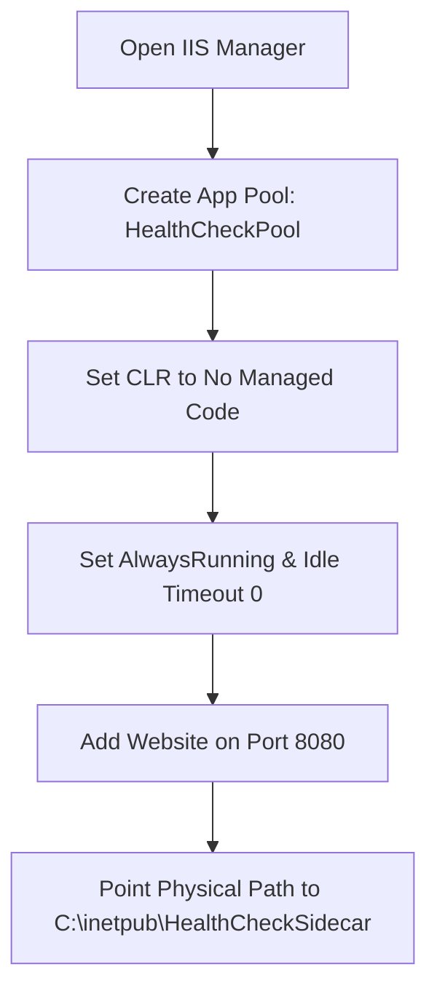
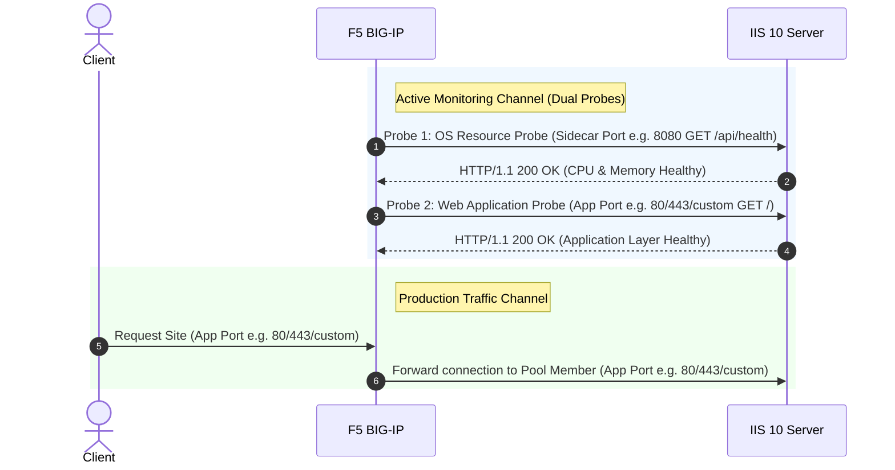

# IIS 10 Health Check Sidecar (.NET 8 Web API)

A lightweight, high-performance **ASP.NET Core (.NET 8) Web API** sidecar application designed for Windows Server & IIS 10 environments. It continuously monitors underlying host OS health and delivers real-time health status probes (`/api/health`) for load balancers such as **F5 BIG-IP**.

---

## Executive Overview

### 💡 What It Is
The **IIS 10 Health Check Sidecar** is a dedicated management microservice hosted alongside your production IIS web applications (typically bound to an isolated management port such as `8080`). It exposes clean HTTP status endpoints (`200 OK` vs. `503 Service Unavailable`) and structured JSON health metrics designed specifically for F5 BIG-IP LTM health monitors.

### ❓ Why It Is Needed
Traditional load balancer health monitors probe only the web application's root URL (e.g., `GET /`). While this confirms that IIS can serve a basic static page, it creates major operational blind spots in production:
* **The "CPU Exhaustion" Blind Spot**: A web server running at 100% CPU will continue responding to simple HTTP pings, but will stall or time out when real users attempt complex application requests.
* **The "Thread Deadlock" Blind Spot**: When backend database connection pools exhaust or worker threads deadlock, CPU usage might remain deceptively low (15–20%), while incoming requests pile up in `http.sys`. Standard HTTP monitors fail to detect this hanging queue.
* **The "Disk Crash" Blind Spot**: Out-of-disk conditions on `C:\` cause IIS logging to stall, temporary ASP.NET Core compilations to fail, and AppPool worker processes to crash unexpectedly.

**The Solution**: By deploying this health check sidecar, F5 BIG-IP evaluates **real-time system resource health** before routing client traffic to a node. If any host resource crosses its safe operating threshold, the sidecar returns `HTTP 503`, allowing BIG-IP to gracefully drain traffic from the saturated node *before* end-users experience errors or outages.

### ⚙️ How It Works
1. **Background Resource Sampler**: An ASP.NET Core `BackgroundService` (`MetricsCollectorService`) samples Windows OS metrics every 1 second in a non-blocking background thread using native Windows Win32 P/Invoke APIs (`kernel32.dll`), `DriveInfo`, and `PerformanceCounter`.
2. **Configurable Thresholds & Toggles**: Administrators can selectively enable or disable individual health checks and tune threshold limits in `appsettings.json`.
3. **Automated Health Evaluation**: When F5 BIG-IP sends an HTTP probe (`GET /api/health`), the endpoint compares current samples against configured thresholds:
   * **All Enabled Checks Pass**: Returns `HTTP 200 OK` with JSON metrics.
   * **Any Threshold Breached**: Returns `HTTP 503 Service Unavailable` with a detailed failure reason.

---

### 📊 Monitored Metrics

Administrators can independently enable, disable, and configure thresholds for the following key metrics in `appsettings.json`:

* 🖥️ **CPU Usage (`MaxCpuPercentage`)**:
  * **How it works**: Uses Windows native `GetSystemTimes` Win32 kernel API to calculate total host CPU utilization across all cores.
  * **Default Threshold**: `85.0%` max CPU.
* 🧠 **System Memory / RAM (`MaxMemoryPercentage`)**:
  * **How it works**: Uses Windows native `GlobalMemoryStatusEx` Win32 API to measure physical RAM consumption across the Windows host.
  * **Default Threshold**: `90.0%` max RAM.
* 💾 **Free Disk Space (`MinDiskSpacePercentage`)**:
  * **How it works**: Uses .NET `DriveInfo` to measure remaining free disk space percentage on the system drive (`C:\`).
  * **Default Threshold**: `10.0%` min free space remaining.
* 🚦 **IIS Request Queue Length (`MaxQueueLength`)**:
  * **How it works**: Queries the Windows Performance Counter (`HTTP Service Request Queues\CurrentQueueSize`) for your application's IIS AppPool to measure requests queued in `http.sys`.
  * **Default Threshold**: `50` max queued requests.

---

## Table of Contents

- [Executive Overview](#executive-overview)
  - [What It Is](#-what-it-is)
  - [Why It Is Needed](#-why-it-is-needed)
  - [How It Works](#%EF%B8%8F-how-it-works)
  - [Monitored Metrics](#-monitored-metrics)
- [Prerequisites (What to Install First)](#prerequisites-what-to-install-first)
  - [1. IIS Server Role Features](#1-iis-server-role-features)
  - [2. Install the .NET 8 Hosting Bundle](#2-install-the-net-8-hosting-bundle)
  - [3. Restart IIS Services](#3-restart-iis-services)
- [Repository Architecture & Code Structure](#repository-architecture--code-structure)
- [Build & Publish](#build--publish)
- [Step 1: Configuration (`appsettings.json`)](#step-1-configuration-appsettingsjson)
- [Step 2: Configure the Sidecar Site in IIS 10](#step-2-configure-the-sidecar-site-in-iis-10)
- [Step 3: Test and Verify Locally](#step-3-test-and-verify-locally)
- [Step 4: Secure the Endpoint for F5 BIG-IP Only](#step-4-secure-the-endpoint-for-f5-big-ip-only)
- [Troubleshooting Guide](#troubleshooting-guide)
- [Monitor with BIG-IP](#monitor-with-big-ip)
  - [Step-by-Step BIG-IP Health Monitor Setup](#step-by-step-big-ip-health-monitor-setup)
  - [Failover & Outage Behavior](#failover--outage-behavior)

---

## Prerequisites (What to Install First)

Before starting, ensure your Windows Server has the required IIS Role Features and .NET runtime installed.

### 1. IIS Server Role Features

Ensure the following IIS features are installed via **Server Manager** or **PowerShell**:

| Feature Category | IIS Feature Name (`WindowsFeature`) | Status | Purpose |
| :--- | :--- | :--- | :--- |
| **Web Server Core** | `Web-Server`, `Web-WebServer` | **Required** | Core IIS 10 HTTP hosting engine. |
| **App Development** | `Web-ISAPI-Ext`, `Web-ISAPI-Filter` | **Required** | Native module handlers required by `AspNetCoreModuleV2`. |
| **Web Security** | `Web-IP-Security` (*IP and Domain Restrictions*) | **Recommended** | Restricts sidecar port access (default: 8080) strictly to F5 BIG-IP Self-IP addresses. |
| **Web Security** | `Web-Filtering` (*Request Filtering*) | **Recommended** | Restricts unneeded HTTP verbs and dangerous request payloads. |
| **Diagnostics** | `Web-Http-Logging`, `Web-Http-Errors` | **Recommended** | Standard HTTP error handling and request logging. |
| **Management** | `Web-Mgmt-Console` (*IIS Management Console*) | **Recommended** | GUI management console (`inetmgr`). |

#### 🚀 Quick Installation via PowerShell
To install all required and recommended IIS features at once, open **PowerShell as Administrator** and run:

```powershell
Install-WindowsFeature -Name Web-Server, Web-WebServer, Web-Common-Http, Web-Default-Doc, Web-Http-Errors, Web-Static-Content, Web-Health, Web-Http-Logging, Web-Performance, Web-Stat-Compress, Web-Security, Web-Filtering, Web-IP-Security, Web-Mgmt-Console -IncludeManagementTools
```

---

### 2. Install the .NET 8 Hosting Bundle
1. Download the [.NET 8.0 Hosting Bundle Installer](https://dotnet.microsoft.com/en-us/download/dotnet/8.0).
2. Run `dotnet-hosting-8.0.x-win.exe` on the Windows Server.

> [!IMPORTANT]
> You **must** install the **Hosting Bundle**, not just the .NET SDK or .NET Runtime alone. The Hosting Bundle registers the native `AspNetCoreModuleV2` into the IIS schema.

---

### 3. Restart IIS Services
Open **Command Prompt (CMD)** as Administrator and execute:
```cmd
net stop was /y
net start w3svc
```
*(or run `iisreset`)*

---

## Repository Architecture & Code Structure

```
├── HealthCheckSidecar.csproj    # .NET 8 Web API Project File
├── Program.cs                   # Application entrypoint & health routes (/api/health)
├── Models/
│   └── HealthOptions.cs         # Strong-typed threshold settings
├── Services/
│   └── MetricsCollectorService.cs # Background service sampling live CPU & Memory
├── appsettings.json             # Resource threshold configuration
├── web.config                   # IIS AspNetCoreModuleV2 handler configuration
├── health.asp                   # Classic ASP legacy reference script
└── readme.md                    # Documentation
```

---

## Build & Publish

To compile and publish the sidecar application for deployment:

1. Clone or download this repository.
2. Open a Command Prompt or Terminal in the repository folder.
3. Run the publish command:
   ```cmd
   dotnet publish -c Release -o C:\inetpub\HealthCheckSidecar
   ```
This compiles `HealthCheckSidecar.dll` and outputs all required runtime assets to `C:\inetpub\HealthCheckSidecar`.

---

## Step 1: Configuration (`appsettings.json`)

Edit `appsettings.json` in your deployment directory to select which metrics to monitor and customize resource thresholds:

```json
{
  "Logging": {
    "LogLevel": {
      "Default": "Information",
      "Microsoft.AspNetCore": "Warning"
    }
  },
  "AllowedHosts": "*",
  "HealthThresholds": {
    "EnableCpuCheck": true,
    "EnableMemoryCheck": true,
    "EnableDiskCheck": true,
    "EnableQueueCheck": true,
    "MaxCpuPercentage": 85.0,
    "MaxMemoryPercentage": 90.0,
    "TotalSystemRamGb": 16.0,
    "MinDiskSpacePercentage": 10.0,
    "MaxQueueLength": 50.0,
    "AppPoolName": "HealthCheckPool"
  }
}
```

### Toggle Switches (Enable / Disable Checks)
* **EnableCpuCheck**: Set to `true` to monitor CPU usage (`false` to disable).
* **EnableMemoryCheck**: Set to `true` to monitor RAM usage (`false` to disable).
* **EnableDiskCheck**: Set to `true` to monitor free disk space (`false` to disable).
* **EnableQueueCheck**: Set to `true` to monitor IIS HTTP request queue size (`false` to disable).

### Threshold Settings
* **MaxCpuPercentage**: HTTP 503 is returned if server CPU usage exceeds this threshold (e.g. `85.0`%).
* **MaxMemoryPercentage**: HTTP 503 is returned if server Memory usage exceeds this threshold (e.g. `90.0`%).
* **MinDiskSpacePercentage**: HTTP 503 is returned if system drive (`C:`) free disk space falls below this threshold (e.g. `10.0`%).
* **MaxQueueLength**: HTTP 503 is returned if IIS `http.sys` request queue length exceeds this count (e.g. `50`).
* **AppPoolName**: Target IIS Application Pool name monitored for request queue size (e.g. `HealthCheckPool`).

---

## Step 2: Configure the Sidecar Site in IIS 10



### 1. Create a Dedicated Application Pool
1. Open IIS Manager (`inetmgr`).
2. Right-click **Application Pools** -> **Add Application Pool...**
3. Name: `HealthCheckPool`
4. Set **.NET CLR version** to **No Managed Code** (required for ASP.NET Core In-Process hosting).
5. Click **OK**.
6. Select `HealthCheckPool`, click **Advanced Settings...**:
   * Change **Start Mode** from `OnDemand` to `AlwaysRunning`.
   * Change **Idle Time-out (minutes)** from `20` to `0`.
7. Click **OK**.

### 2. Create the Website
1. Right-click **Sites** -> **Add Website...**
2. **Site name:** `HealthCheckSidecar`
3. **Application pool:** `HealthCheckPool`
4. **Physical path:** `C:\inetpub\HealthCheckSidecar`
5. **Binding:** Set Port to `8080` (recommended default, or any available custom port like `8081` if `8080` is in use).
6. Click **OK**.

> [!NOTE]
> **Port Selection Flexibility**: Port `8080` is documented as the recommended default. If port `8080` is already in use by another application on your server, simply assign any available port (such as `8081`, `8088`, or `9090`) in IIS Manager and configure the matching port in BIG-IP as the **Alias Service Port**.

---

## Step 3: Test and Verify Locally

1. Open a browser on the server or run `curl`:
   ```bash
   curl -i http://localhost:8080/api/health
   ```
2. Response when Healthy (`HTTP 200 OK`):
   ```json
   {
       "status": "Healthy",
       "cpu": "12.4%",
       "memory": "48.2%",
       "diskFree": "35.8%",
       "queueLength": 0,
       "reason": "Healthy"
   }
   ```
3. If CPU, Memory, Disk Space, or Request Queue exceeds thresholds, the endpoint automatically returns `HTTP 503 Service Unavailable`:
   ```json
   {
       "status": "Unhealthy",
       "cpu": "89.1%",
       "memory": "48.2%",
       "diskFree": "35.8%",
       "queueLength": 0,
       "reason": "Threshold breached (CPU: 89.1% > 85%)"
   }
   ```

---

## Step 4: Secure the Endpoint for F5 BIG-IP Only

1. In IIS Manager, select `HealthCheckSidecar`.
2. Double-click **IP Address and Domain Restrictions** (*requires `Web-IP-Security` feature*).
3. Click **Add Allow Entry...** and add your BIG-IP Self-IP addresses.
4. Click **Edit Feature Settings...** and set **Access for unspecified clients** to `Forbidden` or `Abort`.

---

## Troubleshooting Guide

### ❌ `HTTP Error 500.19 - Internal Server Error` (Error Code `0x8007000d`)

```text
Module: IIS Web Core
Error Code: 0x8007000d
Config File: \\?\C:\inetpub\HealthCheckSidecar\web.config
```

#### Cause
Error Code `0x8007000d` (`ERROR_INVALID_DATA`) occurs because IIS does not recognize the `<aspNetCore>` section in `web.config`. This happens when the **.NET Core Hosting Bundle** (`AspNetCoreModuleV2`) is not installed on the Windows Server, or IIS was not restarted after installation.

#### Resolution Steps
1. **Install .NET Core Hosting Bundle**:
   - Download and run the [.NET 8.0 Hosting Bundle Installer](https://dotnet.microsoft.com/en-us/download/dotnet/8.0).
2. **Restart IIS Services**:
   - Open Command Prompt as Administrator and run:
     ```cmd
     net stop was /y
     net start w3svc
     ```
3. **Verify Module Registration**:
   - Open PowerShell as Administrator and run:
     ```powershell
     Get-WebGlobalModule | Where-Object { $_.Name -eq "AspNetCoreModuleV2" }
     ```
   - If registered, refresh the site in IIS Manager. The 500.19 error will be resolved.

---

## Monitor with BIG-IP

When your backend application servers run on web ports (such as HTTP 80, HTTPS 443, or a custom application port), but your health check sidecar is hosted on port 8080 (or your chosen custom management port), you configure the BIG-IP health monitor using an **Alias Service Port**. 

For complete end-to-end reliability, it is recommended to use a **Dual-Monitor Strategy** on BIG-IP:
* **Sidecar Probe (Port 8080 or custom sidecar port)**: Monitors OS-level CPU and RAM performance.
* **Application Probe (Port 80, 443, or custom application port)**: Probes the actual web application endpoint to verify application layer health.



---

### Step-by-Step BIG-IP Health Monitor Setup

#### Step 1: Create the Custom Sidecar Monitor
1. Log in to the **BIG-IP Configuration Utility (GUI)**.
2. Navigate on the left menu to: **Local Traffic** ➡️ **Monitors**.
3. Click the **Create...** button in the upper-right corner.
4. Configure the settings precisely as follows:
   * **Name**: `mon_iis10_sidecar_8080` (or `mon_iis10_sidecar_<port>`)
   * **Type**: `HTTP`
   * **Send String**: `GET /api/health HTTP/1.1\r\nHost: localhost\r\nConnection: close\r\n\r\n`
   * **Receive String**: `200 OK`
   * **Alias Address**: `* All Addresses` (wildcard automatically targets each pool member's IP address)
   * **Alias Service Port**: `8080` (or set to your custom IIS sidecar port, e.g. `8081`)
5. Click **Finished** to save the monitor.


#### Step 2: Apply Dual Monitors to Your Production Pool

> [!TIP]
> **Best Practice — Recommended Dual-Monitor Strategy**:
> Combining the IIS Health Check sidecar monitor with a standard application health monitor ensures complete coverage:
> 1. **Server OS Health Monitor** (`mon_iis10_sidecar_8080`): Ensures the Windows Server host has sufficient CPU and RAM headroom (probed via the sidecar port, e.g., `8080`).
> 2. **Application Health Monitor** (`mon_http_app` / `mon_https_app`): Ensures the web application itself is active and serving healthy responses on its primary application port — whether standard HTTP (`80`), HTTPS (`443`), or a custom application port (`8080`, `8443`, `5000`, etc.).
>
> Requiring **both** monitors to pass guarantees client traffic is routed only to servers that are both **physically healthy** and **functionally healthy**.

1. Navigate in BIG-IP to: **Local Traffic** ➡️ **Pools** ➡️ **Pool List**.
2. Click on your active web application pool (containing your IIS members listening on Port 80, 443, or your application port).
3. On the **Properties** tab, locate the **Health Monitors** section.
4. In the **Available** list, select **both** monitors:
   * `mon_iis10_sidecar_8080` (OS CPU/RAM sidecar monitor)
   * `mon_http` / `mon_https_app_check` (Application endpoint monitor)
5. Click the **<< (Add)** button to move both monitors into the **Active** list.
6. Verify **Availability Requirement** is set to **All** (default `AND` rule, requiring both monitors to pass).
7. Click **Update** at the bottom of the page.

---

### Failover & Outage Behavior

When utilizing dual health monitors on a BIG-IP pool member:

* **Resource Threshold Breach (High CPU/RAM)**: The sidecar probe on Port `8080` (or custom sidecar port) receives `HTTP 503 Service Unavailable`. BIG-IP marks the member down, protecting the server from crashing under load spikes.
* **Application Failure (App Crash / DB Down)**: The application probe on the application port (e.g., `80`, `443`, or custom app port) receives an `HTTP 50x` error or connection timeout. BIG-IP marks the member down, preventing users from experiencing broken application pages.
* **Member Health Standard**: Production traffic is forwarded to a pool member **only when both probes pass** (`HTTP 200 OK`), providing complete end-to-end fault tolerance.
