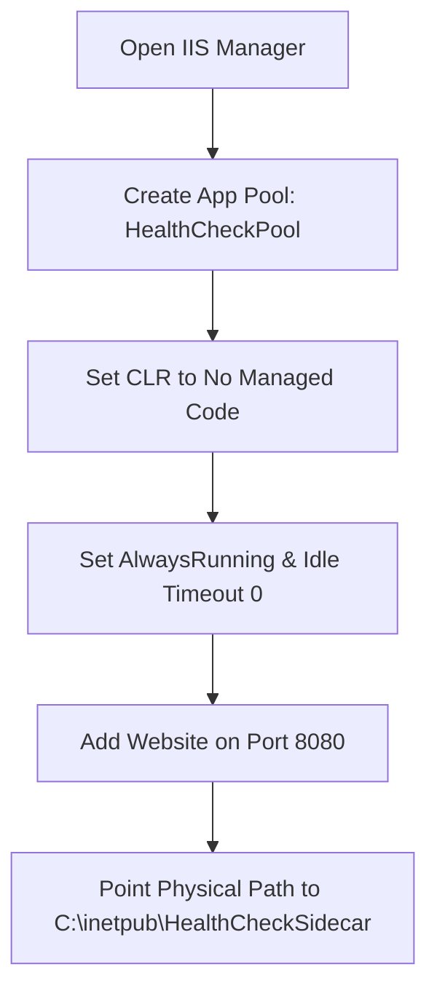
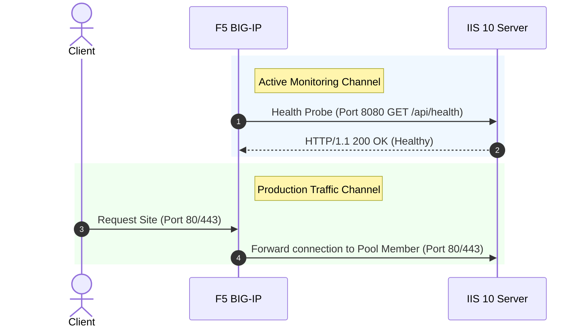

# IIS 10 Health Check Sidecar (.NET 8 Web API)

A lightweight, self-contained **ASP.NET Core (.NET 8) Web API** sidecar application designed to monitor Windows Server CPU and memory metrics in real-time and provide endpoint status probes (`/api/health`) for load balancers such as **F5 BIG-IP**.

---

## Prerequisites (What to Install First)

Before starting, ensure your Windows Server has the required IIS Role Features and .NET runtime installed.

### 1. IIS Server Role Features

Ensure the following IIS features are installed via **Server Manager** or **PowerShell**:

| Feature Category | IIS Feature Name (`WindowsFeature`) | Status | Purpose |
| :--- | :--- | :--- | :--- |
| **Web Server Core** | `Web-Server`, `Web-WebServer` | **Required** | Core IIS 10 HTTP hosting engine. |
| **App Development** | `Web-ISAPI-Ext`, `Web-ISAPI-Filter` | **Required** | Native module handlers required by `AspNetCoreModuleV2`. |
| **Web Security** | `Web-IP-Security` (*IP and Domain Restrictions*) | **Recommended** | Restricts Port 8080 access strictly to F5 BIG-IP Self-IP addresses. |
| **Web Security** | `Web-Filtering` (*Request Filtering*) | **Recommended** | Restricts unneeded HTTP verbs and dangerous request payloads. |
| **Diagnostics** | `Web-Http-Logging`, `Web-Http-Errors` | **Recommended** | Standard HTTP error handling and request logging. |
| **Management** | `Web-Mgmt-Console` (*IIS Management Console*) | **Recommended** | GUI management console (`inetmgr`). |

#### 🚀 Quick Installation via PowerShell
To install all required and recommended IIS features at once, open **PowerShell as Administrator** and run:

```powershell
Install-WindowsFeature -Name Web-Server, Web-WebServer, Web-Common-Http, Web-Default-Doc, Web-Http-Errors, Web-Static-Content, Web-Health, Web-Http-Logging, Web-Performance, Web-Stat-Compress, Web-Security, Web-Filtering, Web-IP-Security, Web-Mgmt-Console -IncludeManagementTools
```

---

### 2. Install the .NET 8 Hosting Bundle
1. Download the [.NET 8.0 Hosting Bundle Installer](https://dotnet.microsoft.com/en-us/download/dotnet/8.0).
2. Run `dotnet-hosting-8.0.x-win.exe` on the Windows Server.

> [!IMPORTANT]
> You **must** install the **Hosting Bundle**, not just the .NET SDK or .NET Runtime alone. The Hosting Bundle registers the native `AspNetCoreModuleV2` into the IIS schema.

---

### 3. Restart IIS Services
Open **Command Prompt (CMD)** as Administrator and execute:
```cmd
net stop was /y
net start w3svc
```
*(or run `iisreset`)*

---

## Repository Architecture & Code Structure

```
├── HealthCheckSidecar.csproj    # .NET 8 Web API Project File
├── Program.cs                   # Application entrypoint & health routes (/api/health)
├── Models/
│   └── HealthOptions.cs         # Strong-typed threshold settings
├── Services/
│   └── MetricsCollectorService.cs # Background service sampling live CPU & Memory
├── appsettings.json             # Resource threshold configuration
├── web.config                   # IIS AspNetCoreModuleV2 handler configuration
├── health.asp                   # Classic ASP legacy reference script
└── readme.md                    # Documentation
```

---

## Build & Publish

To compile and publish the sidecar application for deployment:

1. Clone or download this repository.
2. Open a Command Prompt or Terminal in the repository folder.
3. Run the publish command:
   ```cmd
   dotnet publish -c Release -o C:\inetpub\HealthCheckSidecar
   ```
This compiles `HealthCheckSidecar.dll` and outputs all required runtime assets to `C:\inetpub\HealthCheckSidecar`.

---

## Step 1: Configuration (`appsettings.json`)

Edit `appsettings.json` in your deployment directory to customize resource thresholds:

```json
{
  "Logging": {
    "LogLevel": {
      "Default": "Information",
      "Microsoft.AspNetCore": "Warning"
    }
  },
  "AllowedHosts": "*",
  "HealthThresholds": {
    "MaxCpuPercentage": 85.0,
    "MaxMemoryPercentage": 90.0,
    "TotalSystemRamGb": 16.0
  }
}
```

* **MaxCpuPercentage**: HTTP 503 is returned if server CPU usage exceeds this threshold (e.g. `85.0`%).
* **MaxMemoryPercentage**: HTTP 503 is returned if server Memory usage exceeds this threshold (e.g. `90.0`%).

---

## Step 2: Configure the Sidecar Site in IIS 10



### 1. Create a Dedicated Application Pool
1. Open IIS Manager (`inetmgr`).
2. Right-click **Application Pools** -> **Add Application Pool...**
3. Name: `HealthCheckPool`
4. Set **.NET CLR version** to **No Managed Code** (required for ASP.NET Core In-Process hosting).
5. Click **OK**.
6. Select `HealthCheckPool`, click **Advanced Settings...**:
   * Change **Start Mode** from `OnDemand` to `AlwaysRunning`.
   * Change **Idle Time-out (minutes)** from `20` to `0`.
7. Click **OK**.

### 2. Create the Website
1. Right-click **Sites** -> **Add Website...**
2. **Site name:** `HealthCheckSidecar`
3. **Application pool:** `HealthCheckPool`
4. **Physical path:** `C:\inetpub\HealthCheckSidecar`
5. **Binding:** Set Port to `8080` (or your dedicated management port).
6. Click **OK**.

---

## Step 3: Test and Verify Locally

1. Open a browser on the server or run `curl`:
   ```bash
   curl -i http://localhost:8080/api/health
   ```
2. Response when Healthy (`HTTP 200 OK`):
   ```json
   {
       "status": "Healthy",
       "cpu": "12.4%",
       "memory": "48.2%"
   }
   ```
3. If CPU or Memory exceeds thresholds, the endpoint automatically returns `HTTP 503 Service Unavailable`:
   ```json
   {
       "status": "Unhealthy",
       "cpu": "89.1%",
       "memory": "48.2%"
   }
   ```

---

## Step 4: Secure the Endpoint for F5 BIG-IP Only

1. In IIS Manager, select `HealthCheckSidecar`.
2. Double-click **IP Address and Domain Restrictions** (*requires `Web-IP-Security` feature*).
3. Click **Add Allow Entry...** and add your BIG-IP Self-IP addresses.
4. Click **Edit Feature Settings...** and set **Access for unspecified clients** to `Forbidden` or `Abort`.

---

## Troubleshooting Guide

### ❌ `HTTP Error 500.19 - Internal Server Error` (Error Code `0x8007000d`)

```text
Module: IIS Web Core
Error Code: 0x8007000d
Config File: \\?\C:\inetpub\HealthCheckSidecar\web.config
```

#### Cause
Error Code `0x8007000d` (`ERROR_INVALID_DATA`) occurs because IIS does not recognize the `<aspNetCore>` section in `web.config`. This happens when the **.NET Core Hosting Bundle** (`AspNetCoreModuleV2`) is not installed on the Windows Server, or IIS was not restarted after installation.

#### Resolution Steps
1. **Install .NET Core Hosting Bundle**:
   - Download and run the [.NET 8.0 Hosting Bundle Installer](https://dotnet.microsoft.com/en-us/download/dotnet/8.0).
2. **Restart IIS Services**:
   - Open Command Prompt as Administrator and run:
     ```cmd
     net stop was /y
     net start w3svc
     ```
3. **Verify Module Registration**:
   - Open PowerShell as Administrator and run:
     ```powershell
     Get-WebGlobalModule | Where-Object { $_.Name -eq "AspNetCoreModuleV2" }
     ```
   - If registered, refresh the site in IIS Manager. The 500.19 error will be resolved.

---

## Monitor with BIG-IP

Configure an **Alias Service Port** (`8080`) monitor on BIG-IP:



If the CPU or Memory threshold is breached:
1. The background service registers the high resource consumption.
2. The probe on Port `8080` receives `HTTP/1.1 503 Service Unavailable`.
3. BIG-IP marks the pool member down and reroutes production traffic away from the overloaded server.
