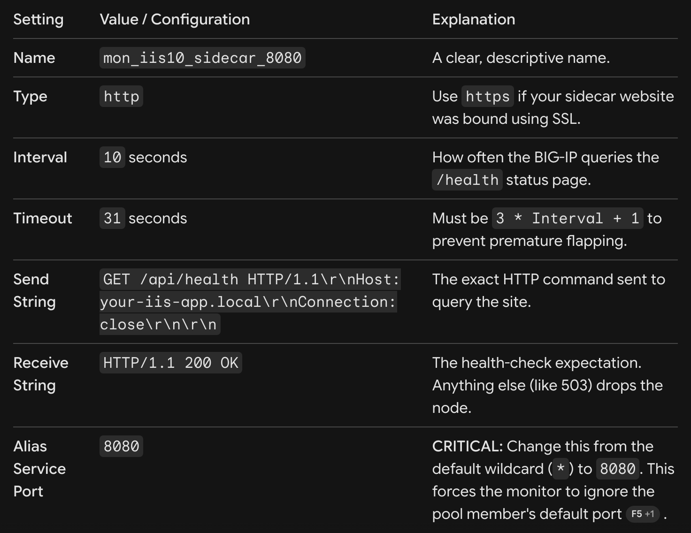

# Configure IIS10 Health Checks

## Prerequisites (What to Install First)
Before starting, we need to make sure your Windows Server has the correct runtime tools installed so it can run modern web apps.

### Install the .NET 8 Hosting Bundle:

Go to the official Microsoft .NET download page.

Download and install the .NET 8.0 Hosting Bundle (this includes both the .NET Runtime and the IIS IIS Out-Of-Process hosting module).

### Restart IIS:

Open your Command Prompt (CMD) as Administrator and type iisreset to ensure IIS registers the new .NET Core module.

## Step 1: Download & Place the "Sidecar" Application Files
We have pre-packaged a complete, self-contained health-check application for you.

Create a folder on your Windows Server where the application will live. For example: C:\inetpub\HealthCheckSidecar

Inside that directory, create three files with the exact names and contents provided below:

📄 File 1: web.config
This file tells IIS 10 how to execute and pass web traffic to the modern .NET application.

📄 File 2: appsettings.json
This controls the configuration of the application. Here, you can easily change your target CPU and Memory thresholds.

📄 File 3: HealthCheckSidecar.dll (Conceptual Note)
Note: In a typical development pipeline, the C# code we discussed previously is compiled into a .dll binary using Microsoft Visual Studio or the dotnet command-line interface. For a rapid PoV deployment, you can compiled this by running the following command in a command prompt inside an empty folder on any computer with the dotnet SDK installed:
`dotnet new webapi -n HealthCheckSidecar` (Replace the boilerplate with our code, and run dotnet publish -c Release -o C:\inetpub\HealthCheckSidecar).

### Step 2: Configure the Sidecar Site in IIS 10
Now, we will map that folder to a brand-new website inside IIS.

graph TD
    A[Open IIS Manager] --> B[Create App Pool: AlwaysRunning]
    B --> C[Add Website on Port 8080]
    C --> D[Point Physical Path to C:\inetpub\HealthCheckSidecar]

#### 1. Create a Dedicated Application Pool
Using a dedicated pool isolates the sidecar so it cannot impact your primary application.

    1. Open IIS Manager (type inetmgr in your Windows search bar).

    2. Right-click on Application Pools in the left connections tree and select Add Application Pool....

    3. Name it HealthCheckPool.

    4. Set the .NET CLR version to No Managed Code (this is correct for modern .NET Core/8 apps!).

    5. Click OK.

    6. Select your new HealthCheckPool from the list, and click Advanced Settings... on the right side.

    7. Change the Start Mode from OnDemand to AlwaysRunning.

    8. Set the Idle Time-out (minutes) from 20 to 0. Click OK.

#### 2. Create the Website
    1. Right-click on Sites in the left connections tree and select Add Website....

    2. **Site name:** HealthCheckSidecar

    3. **Application pool:** Select HealthCheckPool (which we just created).

    4. **Physical path:** Browse to and select C:\inetpub\HealthCheckSidecar.

    5. **Binding:** Change the Port to a custom port that isn't being used by your production site, such as 8080.

    6. Click OK.

### Step 3: Test and Verify Locally
Let's make sure the site is up and actively reading your server's hardware.

    1. Open a browser on the server and navigate to: http://localhost:8080/api/health

    2. You should immediately see a JSON response displaying your live resource metrics:
            {
                "status": "Healthy",
                "cpu": "12.4%",
                "memory": "48.2%"
            }
    
    3. To test your threshold, you can artificially stress your CPU or adjust the limit downward to 1.0% in appsettings.json and recycle the IIS pool. The response will immediately transition to an HTTP 503 (Service Unavailable) state.

### Step 4: Secure the Endpoint for F5 BIG-IP Only
Because Port 8080 is now exposing CPU metrics, we want to block the public from hitting it.

    1. In IIS Manager, select your HealthCheckSidecar website on the left.

    2. In the center pane, double-click IP Address and Domain Restrictions.

    3. In the right actions pane, click **Add Allow Entry....**

    4. Add the Self-IP of your BIG-IP active and standby devices (or the subnet they reside on).

    5. Click **Edit Feature Settings...** in the right actions pane.

    6. Under Access for unspecified clients, select Abort or Forbidden and click OK.

The sidecar is now running natively, safely querying Windows metrics, and ready to signal your BIG-IP!

## Recommended Action Summary

* Recommended Next Step: Copy the three files to C:\inetpub\HealthCheckSidecar, install the .NET Hosting Bundle, and use port 8080 for the IIS binding.

* Watch Out For: Make sure Windows Defender/Windows Firewall allows incoming traffic on port 8080 only from the BIG-IP self-IP addresses.

## Monitor with BIG-IP
When your backend application servers run on standard web ports (such as HTTP 80 or HTTPS 443), but your modern health check sidecar is hosted on port 8080, you must configure the BIG-IP health monitor to use a feature called an Alias Service Port.  This tells the BIG-IP: *"Send production client traffic to the server on port 80/443, but always send the health probes to that same server on port 8080."*

Follow these steps to create the custom port-redirected monitor and apply it to your existing production pool.

### Step 1: Create the Custom Port 8080 Monitor
    1. Log in to the BIG-IP Configuration Utility (GUI).
    2.Navigate on the left menu to: Local Traffic ➡️ Monitors.
    3. Click the Create... button in the upper-right corner.
    4. Configure the settings precisely as follows:

    5. Leave Alias Address set to the default wildcard (* All Addresses). This ensures the monitor automatically targets the unique IP address of whichever pool member it is currently checking 
    6. Click Finished to save the monitor.

### Step 2: Apply the Monitor to Your Existing Pool
Next, bind this new monitor to your production application pool.

    1. Navigate to: Local Traffic ➡️ Pools ➡️ Pool List.
    2. Click on your active web application pool (the pool containing your IIS members listening on Port 80 or 443).
    3. On the Properties tab, locate the Health Monitors section.
    4. In the Available list, select your new mon_iis10_sidecar_8080 monitor and click the << (Add) button to move it into the Active list.
    5. Click Update at the bottom of the page.

#### How This Works Behind the Scenes
Now, the BIG-IP manages traffic routing through two distinct port channels:
<iframe src="https://mermaid.live/embed?theme=dark&look=classic&mode=dark#pako:eNp1kk1PwzAMhv-KldOQNtaNVZp6QIKhsQkhKjYuqJcs9dpobTxcF4QQ_5107UB85eDIyes3T-K8KUMpqkhV-FSjM3hldca6TBz4oWshV5cb5C43QgyzwqKTdmWvWayxe-0E5iHoqomXy-vBMv4tWC5XjaKZRgGskJ-Pxm1kNAKcbXrjSdCH8WTqQxietJuOBIFtlgvQ1p8SwYUR-4xwS856LOsymOXaOSzagnk4OD_3Z30KF6gLySFm2iD0YmKBaTANOn-vHPiCxnixXsfD0ekIxkEAdzfQm8UPw1ssO4fXrgJdmrg_ycOwwQ_-JfcIae2hyMGa9XZrzXf09oU7mvumM5XAysoX9nAyOTv5ec858YvmFAx5q9ZeCGKiAjy97-Jf5YdbqL7K2KYqEq6xr0rkUjepekuU5FhioqJEpZp3ieonqiDaHVZMoavKmkS9ewff40ei8mjCVGe5ira6qHxW71Mtx9_VSt4_ABCVxMU" width="100%" height="480" style="border:0" loading="lazy" title="Mermaid diagram" sandbox="allow-scripts allow-same-origin allow-popups allow-popups-to-escape-sandbox"></iframe>

